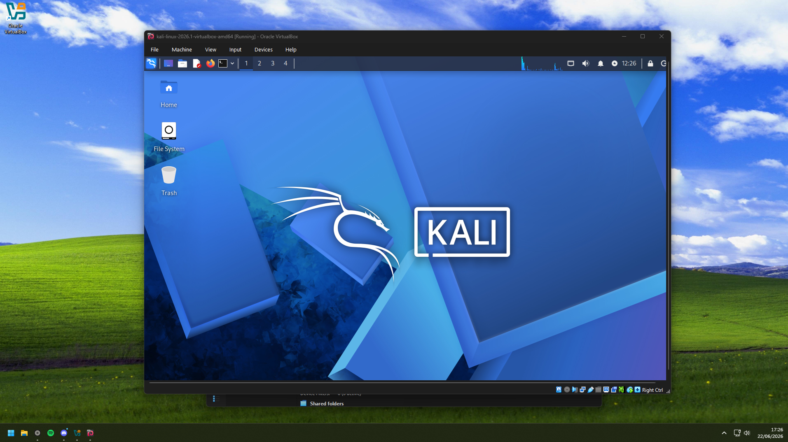
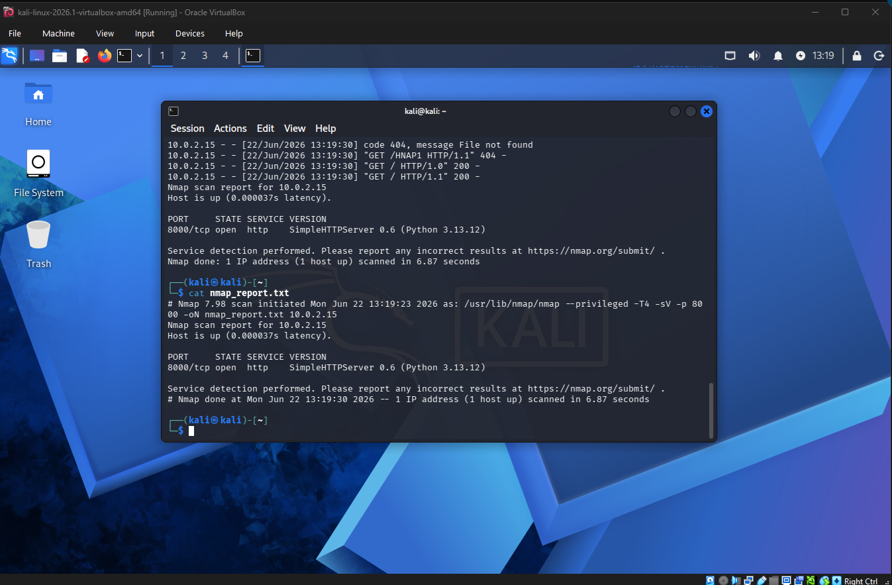

# Hi, I'm Abdu! 👋

I am a Cybersecurity undergraduate student at Kingston University, having recently completed my first year. With a foundation in Object-Oriented Programming (Java) via algorithmic module training, I am dedicating this summer to practical, hands-on infrastructure security, Linux systems administration, and defensive security frameworks.

## 🛠️ Summer 2026 Security Focus
Right now, I am actively bridging the gap between academic programming theory and real-world infrastructure defense by tackling the following tracks:
* **Networking Foundations:** Cisco NetAcad & CCNA foundational networking principles.
* **Linux Infrastructure:** Command-line mastery and terminal navigation via OverTheWire (Bandit).
* **Defensive Labs:** Deploying virtualization architectures to analyze network traffic environments.

---

## 📂 Featured Projects & Lab Write-Ups

### 🖥️ Virtualization & Defensive Home Labs
* **Project Status:** 🟢 Active Environment Setup
* **Description:** Configured and deployed an isolated virtual security lab environment using Oracle VirtualBox. This architecture hosts a Kali Linux instance utilized for safe vulnerability assessments, network routing analysis, and traffic inspection.

#### Environment Blueprint:


### 🖥️ Virtualization & Defensive Home Labs
* **Project Status:** 🟢 Active Environment Setup & Tool Testing
* **Description:** Configured an isolated virtual security lab using Oracle VirtualBox running Kali Linux. Currently executing local network mapping verification protocols.

#### Lab Phase 1: Local Port Discovery & Service Verification
* Hosted a local HTTP application environment on port `8000` to simulate a live target network service.
* Executed reconnaissance verification using `nmap` targeting the local node interface.

**Scan Execution Evidence:**


```text
# Nmap 7.98 scan initiated Mon Jun 22 13:19:23 2026 as: /usr/lib/nmap/nmap --privileged -T4 -sV -p 8000 -oN nmap_report.txt 10.0.2.15
Nmap scan report for 10.0.2.15
Host is up (0.000037s latency).

PORT     STATE SERVICE VERSION
8000/tcp open  http    SimpleHTTPServer 0.6 (Python 3.13.12)

Service detection performed. Please report any incorrect results at https://nmap.org/submit/ .
# Nmap done at Mon Jun 22 13:19:30 2026 -- 1 IP address (1 host up) scanned in 6.87 seconds

```

### 🖥️ Self-Hosted Private Cloud Infrastructure
* **Project Status:** 🟢 Production / Active Maintenance
* **Description:** Designed, deployed, and currently maintaining a centralized local network storage and automated backup infrastructure utilizing bare-metal and containerized environments.

#### Core Components & Architecture:
* **Network Attached Storage (NAS):** Managed via an OpenMediaVault (OMV) architecture, handling local network data integrity and storage pools.
* **Containerized Services:** Utilizing Docker to host an isolated Immich ecosystem for automated, secure device photo backups.
* **Secure Administration:** Implementing strict user privilege isolation, local firewall configurations, and SSH-key authenticated remote management protocols.

#### Deployment & Configuration Architecture
To maintain infrastructure-as-code principles, the environment is orchestrated using containerized configurations isolated from sensitive production credentials.

<details>
<summary>📦 View Sanitized Docker-Compose Configuration</summary>

```yaml
name: immich

services:
  immich-server:
    container_name: immich_server
    image: ghcr.io/immich-app/immich-server:${IMMICH_VERSION:-release}
    volumes:
      - ${UPLOAD_LOCATION}:/data
      - /etc/localtime:/etc/localtime:ro
      - ${EXTERNAL_MEDIA_PATH}:/mnt/valclips:ro
    env_file:
      - .env
    ports:
      - '2283:2283'
    depends_on:
      - redis
      - database
    restart: always
    healthcheck:
      disable: false

  immich-machine-learning:
    container_name: immich_machine_learning
    image: ghcr.io/immich-app/immich-machine-learning:${IMMICH_VERSION:-release}
    volumes:
      - model-cache:/cache
    env_file:
      - .env
    restart: always
    healthcheck:
      disable: false

  redis:
    container_name: immich_redis
    image: docker.io/valkey/valkey:9@sha256:3b55fbaa0cd93cf0d9d961f405e4dfcc70efe325e2d84da207a0a8e6d8fde4f9
    healthcheck:
      test: redis-cli ping || exit 1
    restart: always

  database:
    container_name: immich_postgres
    image: ghcr.io/immich-app/postgres:14-vectorchord0.4.3-pgvectors0.2.0@sha256:bcf63357191b76a916ae5eb93464d65c07511da41e3bf7a8416db519b40b1c23
    environment:
      POSTGRES_PASSWORD: ${DB_PASSWORD}
      POSTGRES_USER: ${DB_USERNAME}
      POSTGRES_DB: ${DB_DATABASE_NAME}
      POSTGRES_INITDB_ARGS: '--data-checksums'
    volumes:
      - ${DB_DATA_LOCATION}:/var/lib/postgresql/data
    shm_size: 128mb
    restart: always
    healthcheck:
      disable: false

volumes:
  model-cache:
```
</details>
<details>
<summary>🔑 View Environment Variable Template (.env.example)</summary>

```ini
# Core Application Settings
IMMICH_VERSION=release
UPLOAD_LOCATION=C:/Path/To/Your/Immich/Uploads

# External Media Library Mount
EXTERNAL_MEDIA_PATH=D:/Path/To/Your/MediaFolder

# Database Configuration (Change these in production!)
DB_DATABASE_NAME=immich
DB_USERNAME=postgres
DB_PASSWORD=your_secure_generated_password_here
```
</details>

---
## 🔧 Technical Toolkit
* **Languages:** Java (Core OOP, Basic Data Structures)
* **Platforms & Environments:** Linux (Debian/Kali), Windows, VirtualBox, Git/GitHub
* **Security & Analysis Tools:** Learning Nmap, Wireshark, Core Linux Terminal Utilities

---

### 📫 Connect with me
* **LinkedIn:** [www.linkedin.com/in/abdullah-ghazi-cyber]
* **Professional Contact:** [abdullah.ghazi@proton.me]
